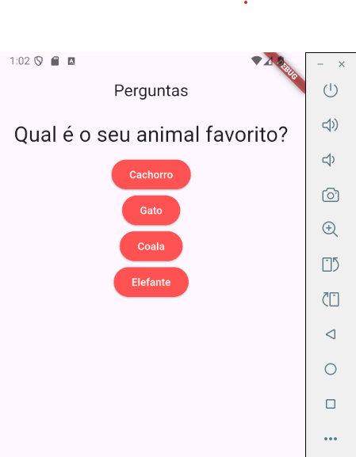

# 📱 Perguntas

Um aplicativo Flutter simples para praticar conceitos iniciais, onde o usuário responde perguntas interativas.

## 🎯 Objetivo

Este projeto foi criado como ponto de partida para estudar Flutter, explorando:

- Widgets básicos (`StatelessWidget`, `StatefulWidget`)
- Gerenciamento simples de estado
- Interatividade com botões (`ElevatedButton`)
- Renderização dinâmica de textos

## 🖼️ Demonstração

Tela inicial com uma pergunta e múltiplas opções de resposta:



## 🚀 Como rodar o projeto

1. Clone este repositório:
   ```bash
   git clone https://github.com/SEU_USUARIO/perguntas.git
   ```
